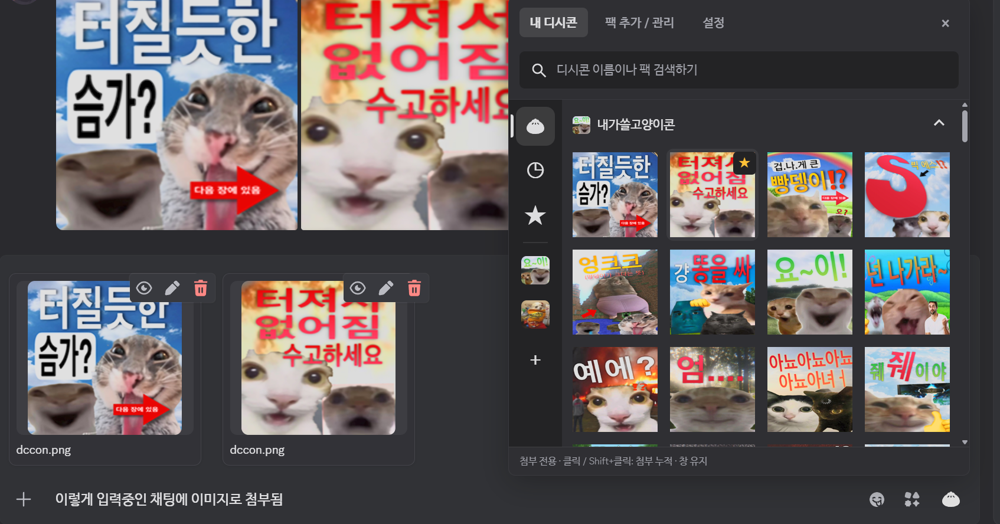

# DCCon for Discord

Discord 채팅 입력창에서 디시콘을 보내는 확장입니다. BetterDiscord 플러그인 또는 일반 Discord에 직접 설치해 사용합니다.


## 주요 기능

- 채팅 입력창의 만두 버튼으로 디시콘 메뉴 열기
- 디시콘 팩 검색·추가·제거, 등록한 콘 검색
- 좌측 팩 탐색, 최근 사용, 즐겨찾기
- 링크 즉시 전송 / 이미지 즉시 전송 / 입력창에 첨부파일 추가 중 선택
- 이미지 전송 모드에서 Shift+클릭으로 여러 콘 모으기
- 의미 기반 검색

## 설치

| 방식 | 대상 |
| --- | --- |
| BetterDiscord | 이미 BetterDiscord를 사용하는 경우 DCCon 플러그인 |
| 스탠드얼론 | 바닐라 디스코드의 경우. 내부적으로는 shelter 번들링으로 작동 |

### BetterDiscord용

먼저 [BetterDiscord](https://betterdiscord.app/)가 설치되어 있어야 합니다. PowerShell에 다음 명령을 입력합니다.

```powershell
& ([scriptblock]::Create((irm https://github.com/80ROkWOC4j/betterdiscord_dccon/releases/latest/download/install.ps1))) -Mode BetterDiscord
```

설치 후 **Discord 설정 → BetterDiscord → 플러그인**에서 DCCon을 활성화합니다.

혹은 수동으로,

1. [Release](https://github.com/80ROkWOC4j/betterdiscord_dccon/releases)에서 `DCCon.plugin.js` 파일을 다운
2. Discord의 **설정 → BetterDiscord → 플러그인 → 플러그인 폴더 열기**로 폴더를 열고
3. 해당 폴더에 파일을 복사하고 DCCon을 활성화

Windows의 일반적인 설치 경로:

```text
%APPDATA%\BetterDiscord\plugins\DCCon.plugin.js
```

### 스탠드얼론

shelter와 DCCon을 함께 설치하며 이미 shelter가 설치된 환경에 플러그인만 추가하는 방식은 현재 제공하지 않습니다.

**Discord를 완전히 종료한 뒤** PowerShell에서 실행합니다.

```powershell
& ([scriptblock]::Create((irm https://github.com/80ROkWOC4j/betterdiscord_dccon/releases/latest/download/install.ps1))) -Mode Standalone
```

### 업데이트와 복구

업데이트는 사용 중인 방식의 설치 명령을 다시 실행하면 됩니다.

스탠드얼론 제거하고 원본 Discord로 복구하려면 Discord를 완전히 종료한 뒤 아래 명령어 실행합니다.

```powershell
& ([scriptblock]::Create((irm https://github.com/80ROkWOC4j/betterdiscord_dccon/releases/latest/download/install.ps1))) -Mode Standalone -Restore
```

## 사용법

### 선택창 열기와 팩 추가

채팅 입력창 오른쪽의 **만두 버튼**을 클릭하면 디시콘 선택창이 열립니다.


**팩 추가 / 관리 → 디시콘샵**에서 이름을 검색하고 **디시콘 추가**를 누릅니다. 추가한 팩은 **내 디시콘** 탭에서 선택할 수 있습니다.


### 전송 방식 선택

**설정 → 디시콘 클릭 동작**에서 세 가지 중 하나를 선택합니다.

| 모드 | 일반 클릭 | Shift+클릭 |
| --- | --- | --- |
| 빠른 전송 | 콘 URL 즉시 전송 | 더블콘 처럼 여러개 이미지로 보냄 |
| 항상 이미지 전송 | 그냥 클릭도 이미지로 전송 | 상동 |
| 클릭 시 첨부파일 추가 | 입력창에 이미지 첨부 파일 형태로 추가 | 일반 클릭과 동일 |

### 기본 사용법

| 조작 | 동작 |
| --- | --- |
| 일반 클릭 | 모아둔 콘과 클릭한 콘을 전송하고 선택창 닫기 |
| Shift+클릭 | 디시콘 누적 하면서 선택창 유지 |
| ☆ / ★ | 즐겨찾기 추가 / 해제 |

Shift+클릭한 콘은 선택창 아래의 **모아둔 콘** 목록에 표시됩니다. 공앱처럼, 여기서 콘 하나를 일반 클릭하면 총 4개가 한 메시지로 전송됩니다.


3개 장전한 상태

빠른 전송 모드에서도 더블콘처럼 한 메세지에 이어 보이게 하기 위해 여러개를 보낼 경우 url 말고 이미지로 보냅니다.  
항상 이미지 전송 모드에서는 단일 콘도 이미지로 전송합니다. 디스코드 임베딩 이미지 안보이게 설정한 사람들한테도 보이지만 좀 느립니다.

### 클릭 시 첨부파일 추가

**설정 → 디시콘 클릭 동작 → 클릭 시 첨부파일 추가**



일반 클릭과 Shift+클릭 모두 Discord 입력창에 파일을 첨부하고 선택창을 유지합니다.

### 이미지 캐시

팩 추가 시 매번 이미지 다운로드를 막기 위해 아래 경로에 전체 콘들을 한번 다운받습니다. 설치 방식에 따라 경로가 다릅니다.

| 설치 방식 | 캐시 경로 |
| --- | --- |
| BetterDiscord | `%APPDATA%\BetterDiscord\plugins\DCCon-cache\` |
| 스탠드얼론 | `%APPDATA%\DCCon-shelter\DCCon-cache\` |

임베딩 모델과 벡터도 각 캐시 폴더의 `embedding-gemma2` 아래에 저장됩니다.

캐시 용량 제한과 자동 정리는 없습니다.

## 의미 기반 검색

설정에서 의미 기반 검색을 키면 임베딩모델을 다운받고 디시콘들 임베딩 합니다. 기존의 검색은 벡터 검색으로 바뀝니다.


## 진단

문제가 있으면 **설정 → 문제 해결 · 버그 제보**에서 마지막 전송 결과를 확인할 수 있습니다.

이슈 제보 시 이것을 사용해 에러 메세지를 확인해서 같이 올려주세요.

## 출처 및 라이선스

- 원본 프로젝트: [DCCon2](https://github.com/minibox24/DCCon) 현재 삭제 상태
- 참고 프로젝트: [Dastan21/BDAddons — FavoriteMedia](https://github.com/Dastan21/BDAddons/blob/main/plugins/FavoriteMedia/FavoriteMedia.plugin.js)
- 스탠드얼론 기반: [shelter](https://github.com/uwu/shelter) — 공식 배포본을 [`vendor/shelter`](vendor/shelter) submodule의 커밋으로 고정
- 라이선스: [GNU GPL v3](LICENSE)

소스에서 빌드할 때는 먼저 `git submodule update --init --recursive`로 의존성을 준비합니다. 이후 `npm ci`, `npm run build:packages`를 실행합니다.
