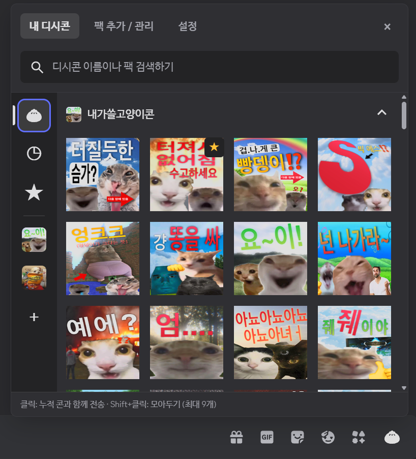
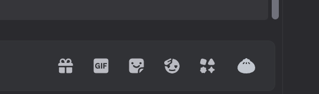
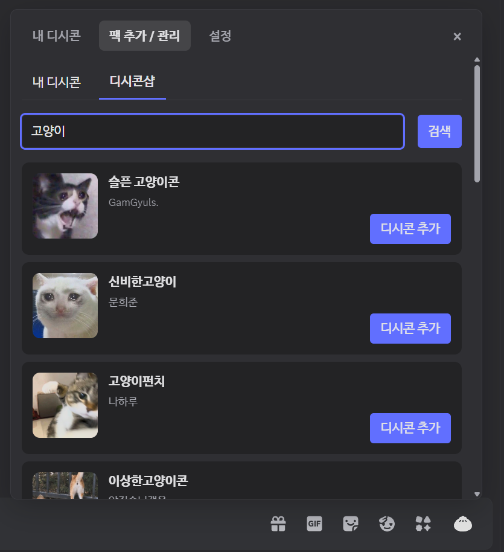
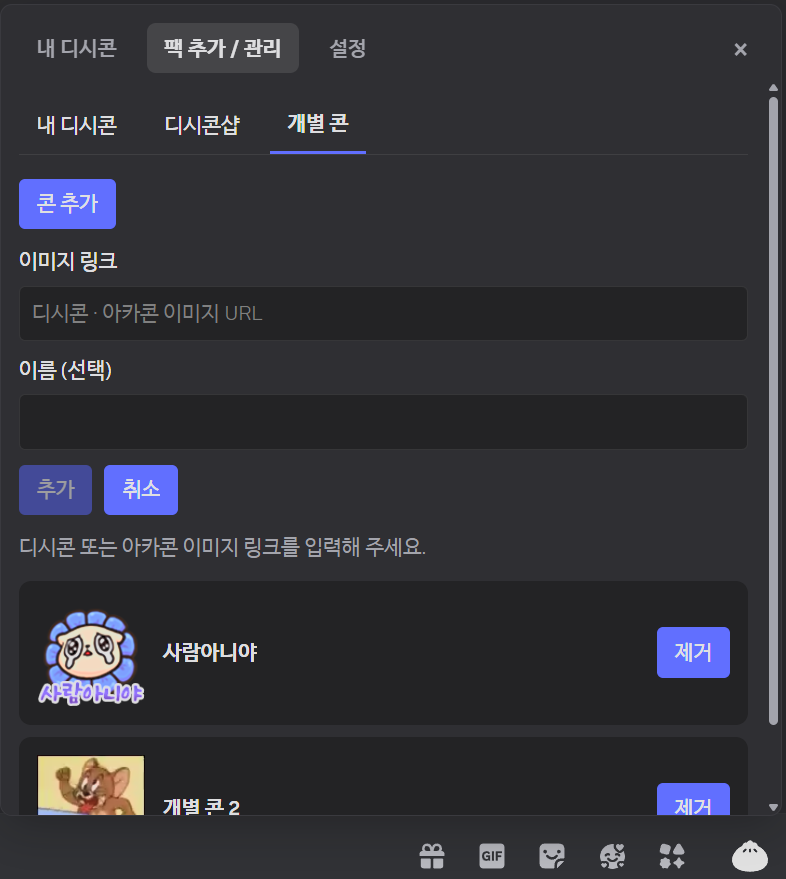
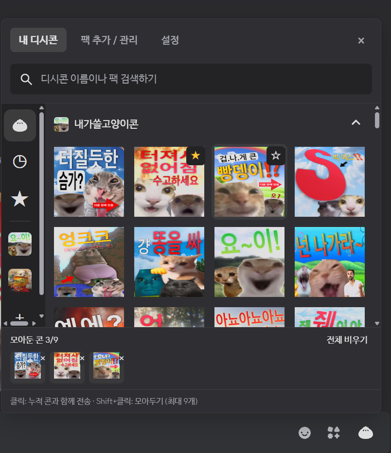
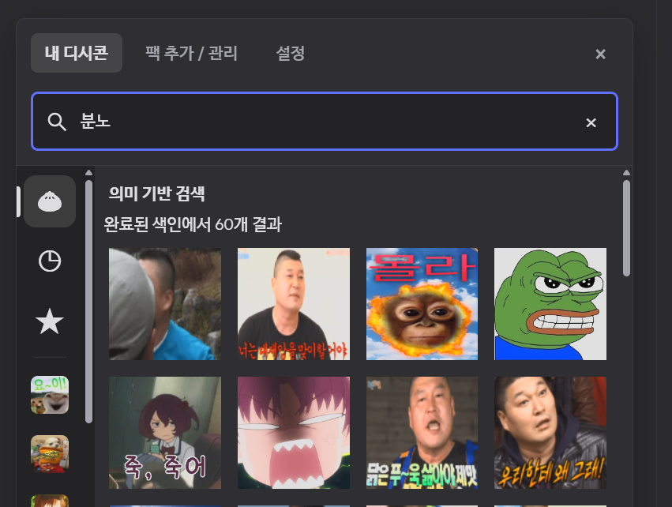
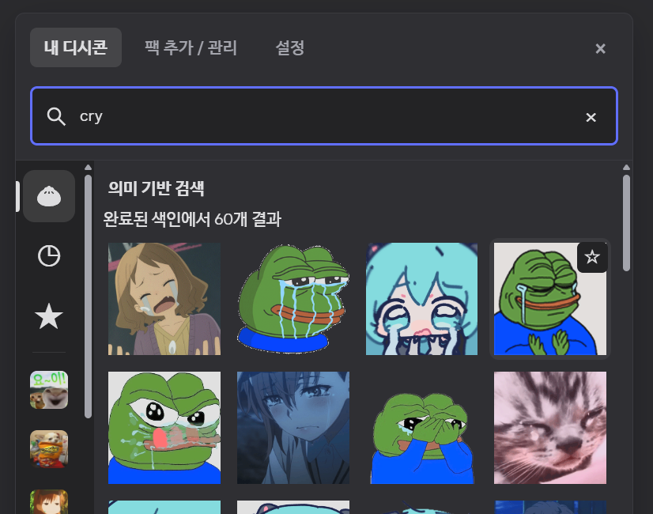
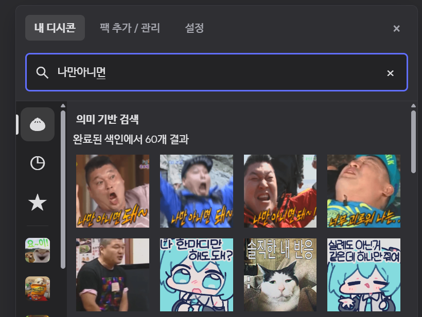

# discord-dccon

Discord 채팅 입력창에서 디시콘을 보내는 확장입니다. BetterDiscord 플러그인 또는 일반 Discord에 직접 설치해 사용합니다.




## 주요 기능

- 클릭하면 디시콘을 이미지로 전송
- 채팅 입력창의 만두 버튼으로 디시콘 메뉴 열기
- 디시콘 팩 검색·추가·제거, 등록한 콘 검색
- 디시콘·아카콘 링크로 개별 콘 추가·제거
- 좌측 팩 탐색, 최근 사용, 즐겨찾기
- Shift+클릭으로 여러 콘을 모아서 함께 전송
- 의미 기반 검색

## 설치

| 방식 | 대상 |
| --- | --- |
| BetterDiscord | 이미 BetterDiscord를 사용하는 경우 discord-dccon 플러그인 |
| 스탠드얼론 | 바닐라 디스코드의 경우. 내부적으로는 shelter 번들링으로 작동 |

### BetterDiscord용

먼저 [BetterDiscord](https://betterdiscord.app/)가 설치되어 있어야 합니다. PowerShell에 다음 명령을 입력합니다.

```powershell
& ([scriptblock]::Create((irm https://github.com/80ROkWOC4j/discord-dccon/releases/latest/download/install.ps1))) -Mode BetterDiscord
```

설치 후 **Discord 설정 → BetterDiscord → 플러그인**에서 discord-dccon을 활성화합니다.

혹은 수동으로,

1. [Release](https://github.com/80ROkWOC4j/discord-dccon/releases)에서 `discord-dccon.plugin.js` 파일을 다운
2. Discord의 **설정 → BetterDiscord → 플러그인 → 플러그인 폴더 열기**로 폴더를 열고
3. 해당 폴더에 파일을 복사하고 discord-dccon을 활성화

Windows의 일반적인 설치 경로:

```text
%APPDATA%\BetterDiscord\plugins\discord-dccon.plugin.js
```

### 스탠드얼론

shelter와 discord-dccon을 함께 설치하며 이미 shelter가 설치된 환경 용 플러그인은 없습니다.

**Discord를 완전히 종료한 뒤** PowerShell에서 실행합니다.

```powershell
& ([scriptblock]::Create((irm https://github.com/80ROkWOC4j/discord-dccon/releases/latest/download/install.ps1))) -Mode Standalone
```

기본 설치 대상은 Discord Stable입니다. **Discord Canary**에는 아래 명령을 사용합니다.

```powershell
& ([scriptblock]::Create((irm https://github.com/80ROkWOC4j/discord-dccon/releases/latest/download/install.ps1))) -Mode Standalone -Channel Canary
```

Canary의 기본 설치 경로는 `%LOCALAPPDATA%\DiscordCanary`입니다. 다른 위치에 설치했다면 `-DiscordRoot '설치 경로'`를 함께 지정합니다.

### 업데이트와 제거

업데이트는 사용 중인 방식의 설치 명령을 다시 실행하면 됩니다.

스탠드얼론 제거하고 원본 Discord로 복구하려면 Discord를 완전히 종료한 뒤 아래 명령어 실행합니다.

```powershell
& ([scriptblock]::Create((irm https://github.com/80ROkWOC4j/discord-dccon/releases/latest/download/install.ps1))) -Mode Standalone -Remove
```

Canary 업데이트·제거 시에도 `-Channel Canary`를 함께 지정합니다.

## 사용법

### 선택창 열기와 팩 추가

채팅 입력창 오른쪽의 **만두 버튼**을 클릭하면 디시콘 선택창이 열립니다.



**팩 추가 / 관리 → 디시콘샵**에서 이름을 검색하고 **디시콘 추가**를 누릅니다. 추가한 팩은 **내 디시콘** 탭에서 선택할 수 있습니다.



### 개별 콘 추가

**팩 추가 / 관리 → 개별 콘 → 콘 추가**에서 디시콘·아카콘 이미지 링크를 등록할 수 있습니다.



### 기본 사용법

| 조작 | 동작 |
| --- | --- |
| 일반 클릭 | 모아둔 콘과 클릭한 콘을 전송하고 선택창 닫기 |
| Shift+클릭 | 디시콘 누적 하면서 선택창 유지 |
| ☆ / ★ | 즐겨찾기 추가 / 해제 |

Shift+클릭한 콘은 선택창 아래의 **모아둔 콘** 목록에 표시됩니다. 공앱처럼, 여기서 콘 하나를 일반 클릭하면 총 4개가 한 메시지로 전송됩니다.



3개 장전한 상태

### 이미지 캐시

팩 추가 시 매번 이미지 다운로드를 막기 위해 아래 경로에 전체 콘들을 한번 다운받습니다. 설치 방식에 따라 경로가 다릅니다.

| 설치 방식 | 캐시 경로 |
| --- | --- |
| BetterDiscord | `%APPDATA%\BetterDiscord\plugins\discord-dccon-cache\` |
| 스탠드얼론 | `%APPDATA%\discord-dccon\discord-dccon-cache\` |
| 스탠드얼론 Canary | `%APPDATA%\discord-dccon-canary\discord-dccon-cache\` |

임베딩 모델과 벡터도 각 캐시 폴더의 `embedding-gemma2` 아래에 저장됩니다.

캐시 용량 제한과 자동 정리는 없습니다.

## 의미 기반 검색

설정에서 의미 기반 검색을 키면 임베딩모델을 다운받고 디시콘들 임베딩 합니다. 기존의 검색은 벡터 검색으로 바뀝니다.





## 진단

문제가 있으면 **설정 → 문제 해결 · 버그 제보**에서 마지막 전송 결과를 확인할 수 있습니다.

이슈 제보 시 이것을 사용해 에러 메세지를 확인해서 같이 올려주세요.

## 출처 및 라이선스

- 원본 프로젝트: [DCCon2](https://github.com/minibox24/DCCon) 현재 삭제 상태
- 참고 프로젝트: [Dastan21/BDAddons — FavoriteMedia](https://github.com/Dastan21/BDAddons/blob/main/plugins/FavoriteMedia/FavoriteMedia.plugin.js)
- 스탠드얼론 기반: [shelter](https://github.com/uwu/shelter) — 공식 배포본을 [`vendor/shelter`](vendor/shelter) submodule의 커밋으로 고정
- 라이선스: [GNU GPL v3](LICENSE)
